# Exercícios de Docker — Do Básico ao Intermediário

# AVISO: nao respondi as questoes na ordem, respondi na ordem que eu achei mais interessante, seja por ter chamado minha atencao ou outra coisa...
 

## Instruções de Entrega

Para cada exercício, documente os comandos executados e arquivos criados em um arquivo chamado `respostas-docker.md`. Veja o modelo de exemplo no final deste documento.

## Nível 1: Fundamentos

### Exercício 1.1 — Hello World

- Execute o container hello-world oficial do Docker Hub.
- Verifique a saída e explique em suas palavras o que aconteceu (pull, create, start).

### Comandos executados

```bash
docker run hello-world
```

### Print:
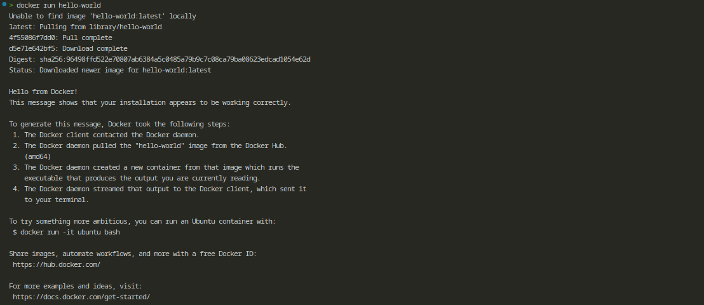

### Explicação:

    o comando docker run hello-world no terminal para testar o ambiente. Como o Docker não encontrou essa imagem de teste salva localmente na máquina, ele se conectou automaticamente ao repositório oficial na nuvem (o Docker Hub) e realizou o download dos arquivos necessários. 
    
    Em seguida, o serviço do Docker criou e executou um contêiner baseado nessa imagem, o qual exibiu a mensagem de sucesso "Hello from Docker!" junto a um passo a passo explicando como a ferramenta se comunicou internamente para processar o comando. Por fim, o terminal exibe sugestões de próximos passos e que a plataforma está pronta para uso.

### Exercício 1.2 — Listar e gerenciar containers

- Liste todos os containers em execução.
- Liste todos os containers (incluindo os parados).
- Remova todos os containers parados de uma só vez.

### Comandos executados

```bash
# Liste todos os containers em execução.
docker ps
# Liste todos os containers (incluindo os parados).
docker ps -a
# Remova todos os containers parados de uma só vez.
docker container prune
```

### Print:
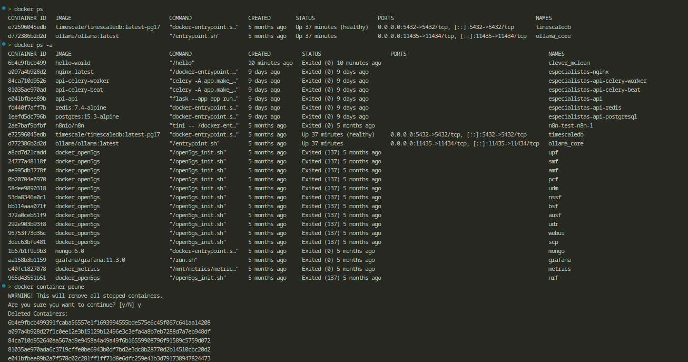

### Explicação:

    Ele começa digitando o comando docker ps, que revela que existem apenas dois contêineres ativos e rodando na máquina naquele momento: o banco de dados timescaledb e o serviço de inteligência artificial ollama_core. 
    Logo depois, ao executar o comando docker ps -a, uma "radiografia" completa é exibida na tela, mostrando uma longa lista de contêineres antigos e desligados (com o status Exited) e até o "hello-world" do exercício anterior.
    
    Para finalizar, foi utilizado o comando docker container prune para fazer uma faxina geral. O Docker emite um aviso claro informando que todos os contêineres parados serão excluídos permanentemente e solicita uma confirmação, que é aceita pelo usuário ao digitar y (sim/yes). 
    O terminal então conclui o processo deletando tudo o que estava inativo e exibindo uma lista com os IDs de identificação de cada item removido, liberando espaço em disco com segurança, já que os serviços que estavam ativos continuam rodando sem nenhuma interrupção...
    
### Exercício 1.3 — Executar um container interativo

- Inicie um container Ubuntu em modo interativo.
- Dentro dele, instale o `curl` e faça uma requisição HTTP para `https://httpbin.org/get`.
- Saia do container e verifique se ele ainda existe.

### Comandos Executados:

```sh
# Execução do ls para demonstrar a atual posição em relação ao sistema de diretórios
ls
# Iniciar container Ubuntu em modo interativo com terminal, como definidio com o 'bash'
docker run -it ubuntu bash

# Para analisar dnv
ls
# Dentro do container, instalar curl e fazer requisição
apt update && apt install -y curl
curl https://httpbin.org/get

# sair do container 
exit

# Verificar se o container ainda existe
docker ps -a
```

### Prints:

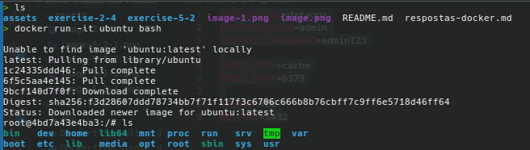

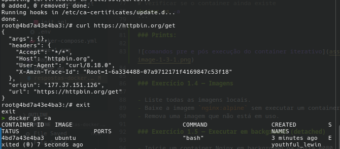

print exibe que  o container foi deixado há 7 segundos atrás

### Explicação:


### Exercício 1.4 — Imagens

- Liste todas as imagens locais.
- Baixe a imagem `nginx:alpine` sem executar um container.
- Remova uma imagem que não está em uso.
---

#### Comandos executados:
```sh
docker images

docker pull nginx:alpine

docker images

docker rmi nginx:alpine
```

#### Explicação:
    
    Primeiramente foi utilizado o comando `docker images` para listar todas as imagens armazenadas localmente no host Docker. Em seguida, a imagem `nginx:alpine` foi baixada do Docker Hub utilizando `docker pull`, sem a necessidade de criar ou executar um container. Após o download, a imagem passou a aparecer na listagem local. Por fim, a imagem foi removida com `docker rmi nginx:alpine`, desde que não estivesse sendo utilizada por nenhum container ativo ou parado.

### Exercício 1.5 — Executar em background (detached)

- Inicie um container Nginx em background na porta 8080.
- Acesse `http://localhost:8080`.
- Pare e remova o container.
---

#### Comandos executados:
```sh
docker run -d --name meu-nginx -p 8080:80 nginx

curl http://localhost:8080

docker stop meu-nginx

docker rm meu-nginx
```
#### Explicação:

    Foi criado um container baseado na imagem Nginx utilizando o modo *detached* (`-d`), permitindo que ele fosse executado em segundo plano. A opção `-p 8080:80` mapeou a porta 8080 da máquina hospedeira para a porta 80 do container, tornando o serviço web acessível em `http://localhost:8080`. O funcionamento foi validado por meio do navegador ou do comando `curl`, que retornou a página padrão do Nginx. Após a verificação, o container foi encerrado com `docker stop` e removido do sistema utilizando `docker rm`.
## Nível 2: Dockerfile e Build

### Exercício 2.1 — Primeiro Dockerfile

- Crie um Dockerfile que:
  - Use `python:3.11-slim` como base.
  - Copie um arquivo `app.py` que imprima `"Docker funcionando!"`.
  - Defina o `CMD` para executar o script.
- Faça o build e execute o container.
---
#### Códigos utilizado:
```docker
FROM python:3.11-slim

WORKDIR /app
COPY app.py .

CMD ["python", "app.py"]
```
#### Comandos executados:
```sh

cat > app.py << 'EOF'
print("Docker funcionando!")
EOF

cat > Dockerfile << 'EOF'
FROM python:3.11-slim

WORKDIR /app
COPY app.py .

CMD ["python", "app.py"]
EOF

docker build -t meu-python-app .
docker run --rm meu-python-app
```
#### Prints:

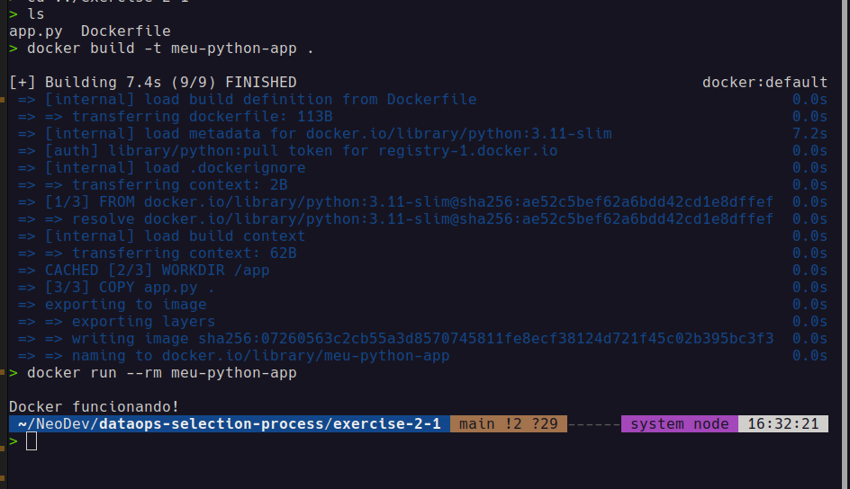

#### Explicação:
    Foi criada uma imagem baseada em python:3.12-slim, o arquivo app.py foi copiado para dentro da imagem e o container executou o script automaticamente ao iniciar. O resultado esperado no terminal é a mensagem Docker funcionando!.


### Exercício 2.2 — Aplicação web simples

- Crie uma aplicação Flask (ou FastAPI) com um endpoint `/health` que retorne `{"status": "ok"}`.
- Escreva um Dockerfile com `requirements.txt`.
- Faça o build, execute e teste o endpoint com curl ou navegador.
---

#### Comandos executados:
```sh

cat > app.py << 'EOF'
from flask import Flask, jsonify

app = Flask(__name__)

@app.get("/health")
def health():
    return jsonify({"status": "ok"})

if __name__ == "__main__":
    app.run(host="0.0.0.0", port=5000)
EOF

cat > requirements.txt << 'EOF'
Flask==3.0.3
EOF

cat > Dockerfile << 'EOF'
FROM python:3.11-slim

WORKDIR /app

COPY requirements.txt .
RUN pip install --no-cache-dir -r requirements.txt

COPY app.py .

EXPOSE 5000

CMD ["python", "app.py"]
EOF

docker build -t flask-health .
docker run --rm -d --name flask-health-app -p 5000:5000 flask-health
curl http://localhost:5000/health
docker stop flask-health-app
```
#### Prints:
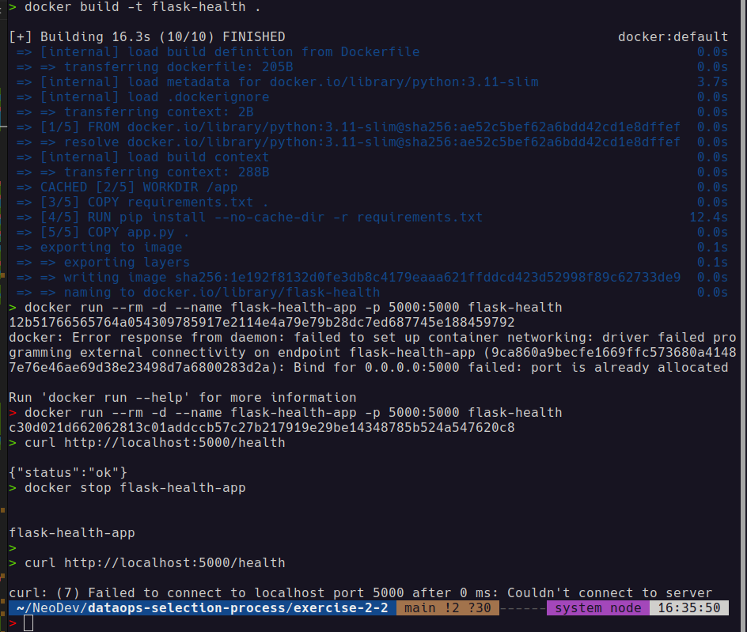

#### Explicação:
    A aplicação Flask foi instalada dentro da imagem com as dependências do requirements.txt. Quando o container subiu, ele expôs a porta 5000 e respondeu no endpoint /health com {"status":"ok"}. O curl confirmou que o serviço estava acessível.

### Exercício 2.3 — .dockerignore

- Crie um arquivo `.dockerignore` que exclua arquivos desnecessários do contexto de build.
- Rebuilde a imagem e verifique que o contexto de build é menor.
---
#### Códigos utilizado:
```
.git
__pycache__
*.log
node_modules
venv
.env
```
#### Comandos executados:
```sh
mkdir exercicio-2.3
cd exercicio-2.3

cat > app.py << 'EOF'
print("teste")
EOF

cat > Dockerfile << 'EOF'
FROM python:3.11-slim
WORKDIR /app
COPY . .
CMD ["python", "app.py"]
EOF

# build inicial, sem dockerignore
docker build -t sem-ignore .

cat > .dockerignore << 'EOF'
.git
__pycache__
*.log
node_modules
venv
.env
EOF

# rebuild após criar o .dockerignore
docker build -t com-ignore .
```

#### Prints:

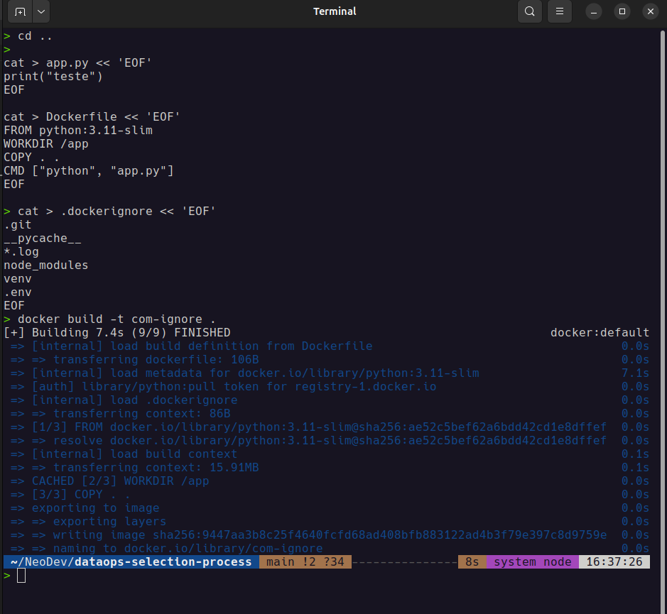

#### Explicação:

    Antes do .dockerignore, tudo que estava na pasta fazia parte do contexto enviado para o Docker. Depois da exclusão dos arquivos desnecessários, o contexto de build ficou menor, o que reduz tempo de envio, consumo de disco e ruído no build. Na saída do docker build, a linha de contexto deve mostrar um tamanho menor após o .dockerignore.

### Exercício 2.4 — Multi-stage build

- Crie um Dockerfile com multi-stage para uma aplicação Go ou Node.js:
  - Stage 1: build da aplicação.
  - Stage 2: imagem final mínima apenas com o artefato de build.
- Compare o tamanho da imagem com e sem multi-stage (use `docker images`).


#### Comandos Executados:
```sh
# Construir a imagem single-stage
docker build -t go-single -f Dockerfile.single .

# Construir a imagem multi-stage
docker build -t go-multi -f Dockerfile.multi .

# Comparar
docker image inspect go-single
docker image inspect go-multi
```
#### Código usado:
```docker
#Single stage
FROM golang:1.26
WORKDIR /app
COPY . .
RUN go build -o app .
EXPOSE 8080
CMD ["./app"]
```
```docker
# Multi-stage
# estágio de build
FROM golang:1.26 AS builder
WORKDIR /build
COPY . .
RUN go build -o app .
# estágio final
FROM alpine:3.18
COPY --from=builder /build/app /app
EXPOSE 8080
CMD ["/app"]
```

#### Print
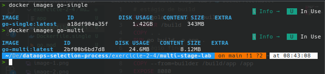

#### Explicação:

#### Os números mostram uma diferença clara:
---
    > go-single: 1.42 GB de uso em disco, com 343 MB de conteúdo.
    >
    > go-multi: 24.6 MB de uso em disco, com 8.12 MB de conteúdo.

    Isso indica que o build em multi-stage removeu quase tudo que é usado só para compilar o programa, deixando na imagem final apenas o binário e o mínimo necessário para executá-lo.
#### Em termos práticos, a imagem go-multi é:
--- 

    - Menos pesada: Ferramentas de compilação, SDKs e dependências de desenvolvimento costumam ocupar muito espaço.

    - Menos vulnerável: Cada ferramenta extra dentro do contêiner é mais uma peça que pode ser explorada em caso de comprometimento.

    - Segue o princípio do menor privilégio: A imagem de produção deve conter apenas o necessário para executar o serviço. Ferramentas usadas só na compilação não precisam estar no ambiente final.
### Erro:
 Eu tentei o Go neste exércicio, mas não me atentei a versão, por eu ter utilizado há um certo tempo, ele estava na versão golang:1.21, e eu tentei puxar o golang:latest, e apresentou erro de compilação.
 Eu atualizei o Go da minha máquina, porque é melhor manter a versão mais recente...
---

### Exercício 2.5 — Cache de camadas

- Crie um Dockerfile para Node.js que aproveite o cache de camadas corretamente.
- Altere apenas o código-fonte (não o `package.json`) e rebuilde — observe que o `npm install` usa cache.
- Documente a ordem das instruções no Dockerfile e explique por que essa ordem importa.
---
#### Códigos utilizado:
```Dockerfile
FROM node:20-slim

WORKDIR /app

COPY package*.json ./
RUN npm install

COPY . .

EXPOSE 3000

CMD ["npm", "start"]

```

```js
const express = require("express");
const app = express();

app.get("/", (req, res) => {
  res.send("Versão 2");
});

app.listen(3000, "0.0.0.0", () => {
  console.log("App rodando na porta 3000");
});

```


#### Comandos executados:
```sh
ocker build -t node-cache-app .
docker run --rm -d --name node-cache-container -p 3000:3000 node-cache-app

# alterar só o código-fonte
cat > index.js << 'EOF'
const express = require("express");
const app = express();

app.get("/", (req, res) => {
  res.send("Versão 2");
});

app.listen(3000, "0.0.0.0", () => {
  console.log("App rodando na porta 3000");
});
EOF

docker build -t node-cache-app .
docker stop node-cache-container
```

#### Prints:

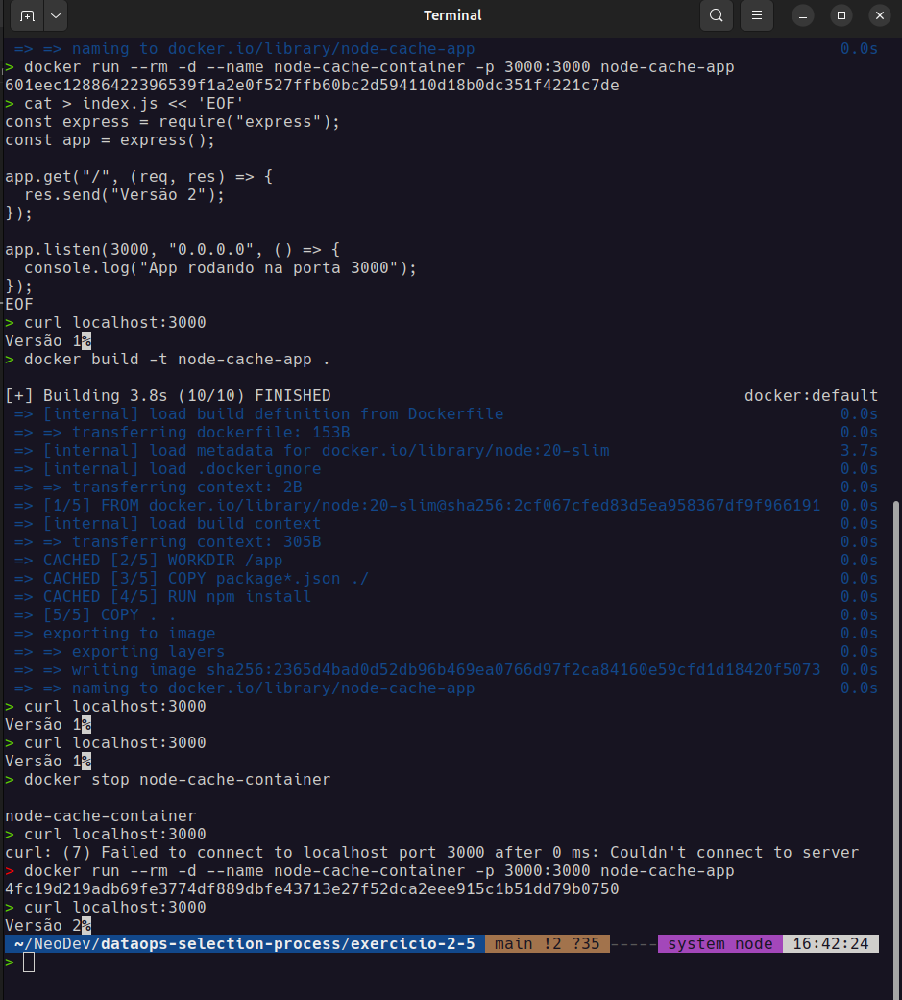

#### Explicação:

    A ordem do Dockerfile foi pensada para aproveitar o cache: primeiro entram apenas package.json e package-lock.json, depois roda o npm install, e só no final o código-fonte é copiado. Assim, quando apenas index.js muda, o Docker reaproveita a camada do npm install e não reinstala as dependências. Isso deixa o rebuild mais rápido.

## Nível 3: Volumes e Persistência

### Exercício 3.1 — Volume nomeado

- Crie um volume nomeado chamado `dados-app`.
- Execute um container que monte esse volume em `/data`.
- Escreva um arquivo dentro de `/data`.
- Pare o container, inicie outro com o mesmo volume e verifique que o arquivo persiste.
---
#### Comandos executados:
```sh
docker volume create dados-app
docker run -it --name teste-vol -v dados-app:/data ubuntu bash
echo "arquivo persistente" > /data/arquivo.txt
exit
docker rm teste-vol
docker run -it --name teste-vol-2 -v dados-app:/data ubuntu bash
cat /data/arquivo.txt
exit
```

#### Prints:

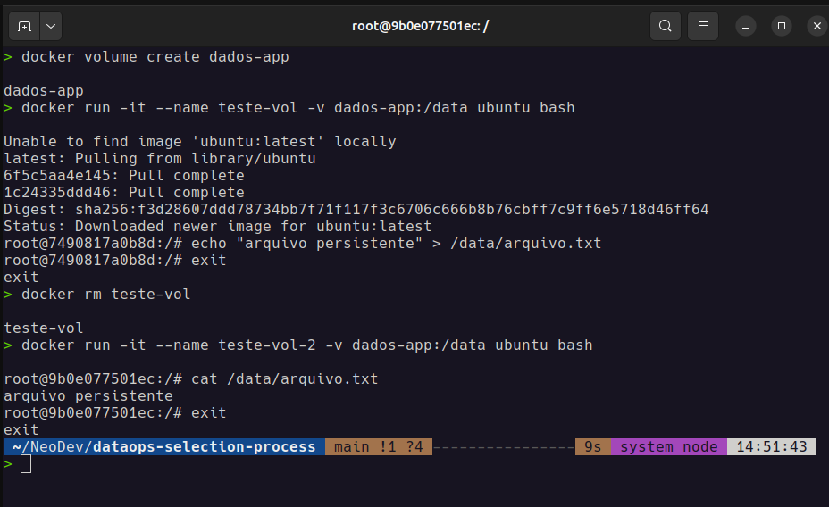

#### Explicação:

    O volume nomeado fica fora do ciclo de vida do container. Quando o primeiro container é parado e removido, os dados continuam armazenados no volume e aparecem novamente ao montar o mesmo volume em outro container.

### Exercício 3.2 — Bind mount

- Monte um diretório local dentro de um container Nginx para servir arquivos estáticos.
- Altere um arquivo HTML no host e verifique a mudança refletida em tempo real no navegador.
---

#### Comandos executados:
```sh
mkdir -p site
cat > site/index.html <<'EOF'
<!doctype html>
<html>
<head><meta charset="utf-8"><title>Docker Nginx</title></head>
<body><h1>Primeira versão</h1></body>
</html>
EOF
docker run -d --name nginx-estatico -p 8080:80 -v "$PWD/site":/usr/share/nginx/html:ro nginx:stable
# Abre no navegador: http://localhost:8080
cat > site/index.html <<'EOF'
<!doctype html>
<html>
<head><meta charset="utf-8"><title>Docker Nginx</title></head>
<body><h1>Segunda versão</h1></body>
</html>
EOF
# Recarregar a página no navegador
```
#### Prints:

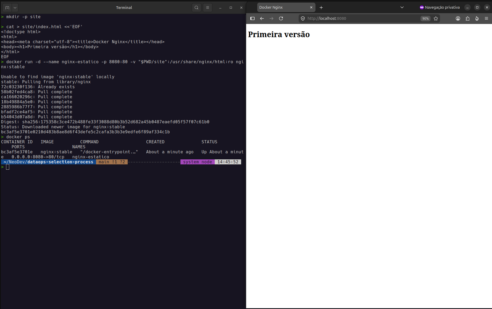

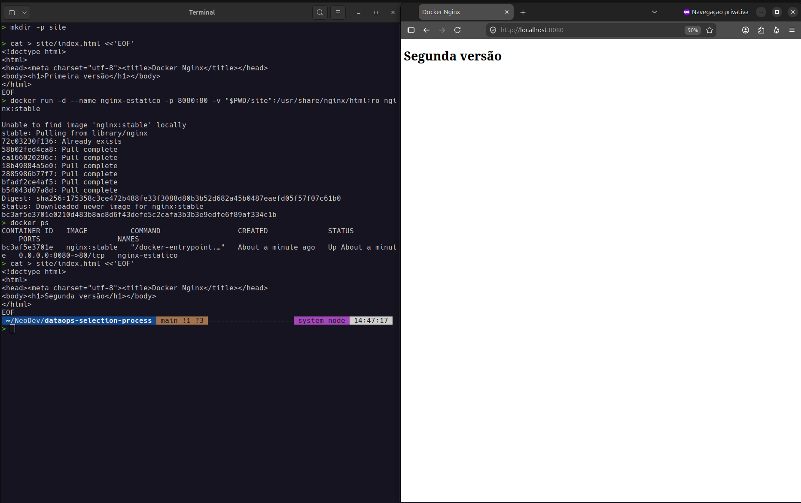

#### Explicação:

    O bind mount liga um diretório do host ao sistema de arquivos do container. Quando o HTML é alterado no host, o Nginx passa a servir a nova versão imediatamente, sem reconstruir a imagem nem recriar o container.

### Exercício 3.3 — Banco de dados com volume

- Execute um container PostgreSQL com volume para persistir os dados.
- Crie uma tabela e insira registros.
- Pare e remova o container.
- Suba novamente com o mesmo volume e verifique que os dados permanecem.
---
#### Comandos executados:
```sh
docker volume create pgdata
docker run -d --name postgres-db -e POSTGRES_PASSWORD=senha123 -e POSTGRES_DB=appdb -v pgdata:/var/lib/postgresql/data -p 5432:5432 postgres:16
docker exec -it postgres-db psql -U postgres -d appdb
CREATE TABLE alunos (id SERIAL PRIMARY KEY, nome TEXT NOT NULL);
INSERT INTO alunos (nome) VALUES ('Ana'), ('Bruno');
SELECT * FROM alunos;
\q
docker rm -f postgres-db
docker run -d --name postgres-db-2 -e POSTGRES_PASSWORD=senha123 -e POSTGRES_DB=appdb -v pgdata:/var/lib/postgresql/data -p 5432:5432 postgres:16
docker exec -it postgres-db-2 psql -U postgres -d appdb -c "SELECT * FROM alunos;"
docker rm -f postgres-db-2
```
#### Prints:

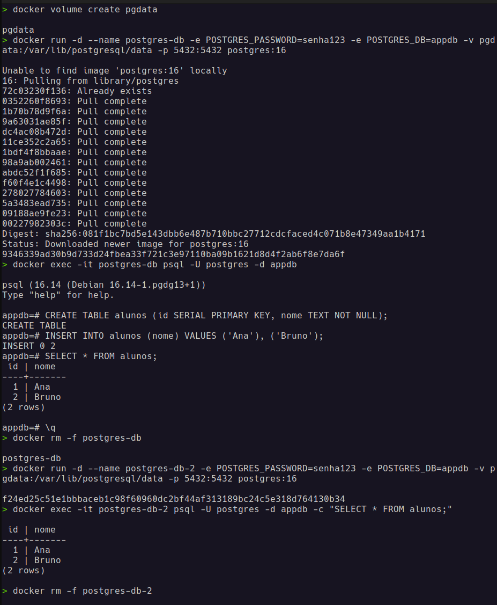


#### Explicação:

    O PostgreSQL grava seus dados no diretório montado pelo volume. Ao remover o container, a base continua intacta no volume. Quando um novo container é iniciado com o mesmo volume, a tabela e os registros continuam disponíveis.
## Nível 4: Networking

### Exercício 4.1 — Network bridge customizada

- Crie uma network bridge chamada `minha-rede`.
- Execute dois containers Alpine nessa rede.
- Verifique que um container consegue pingar o outro pelo nome.

#### Comandos executados:
```sh
docker network create minha-rede
docker run -dit --name alpine1 --network minha-rede alpine sh
docker run -dit --name alpine2 --network minha-rede alpine sh
docker exec -it alpine1 sh
```
#### Prints:
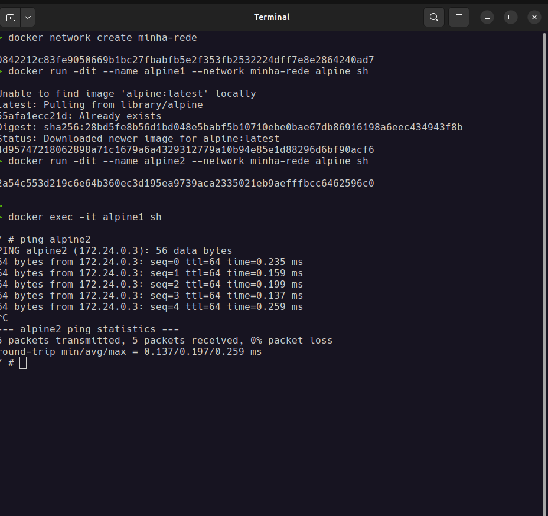

#### Explicação:
    Foi criada uma rede bridge personalizada chamada minha-rede. Em seguida, dois containers Alpine foram iniciados dentro dessa mesma rede. Como ambos compartilham o mesmo DNS interno da network, um container conseguiu resolver e pingar o outro pelo nome (alpine1 e alpine2), sem precisar usar IP.
### Exercício 4.2 — App + Banco na mesma rede

- Crie uma network.
- Suba um container Redis nessa rede.
- Suba uma aplicação Python que se conecta ao Redis usando o nome do container como host.
- Demonstre a comunicação funcionando.


#### Cödigo utilizado:
```python
# app.py
import redis

r = redis.Redis(host="redis", port=6379, decode_responses=True)

r.set("mensagem", "Conexao funcionando")
valor = r.get("mensagem")

print("Valor lido do Redis:", valor)
```

#### Comandos executados:
```sh
docker network create rede-app

docker run -dit --name redis --network rede-app redis:7-alpine

docker run --rm -it --network rede-app -v "$PWD":/app -w /app python:3.11-alpine sh -c "pip install redis && python app.py"
```
#### Prints:
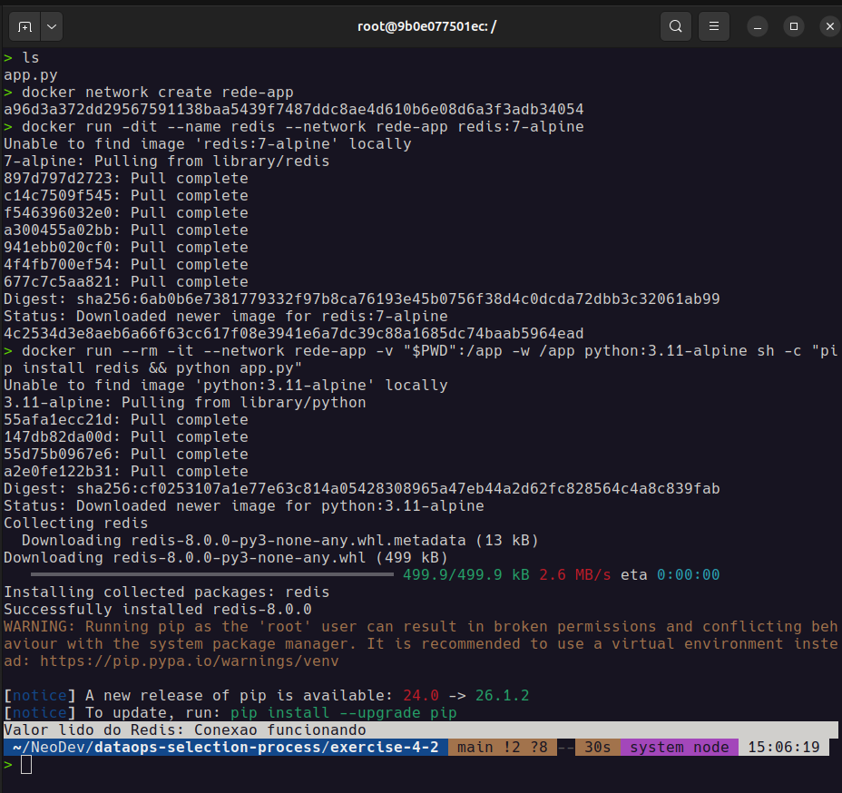


#### Explicação:
    Foi criada uma rede Docker para que a aplicação Python e o Redis pudessem se comunicar pelo nome do container. O Redis foi iniciado com o nome redis, e a aplicação Python usou esse nome como host na conexão. Isso demonstra que, na mesma network, o Docker resolve o nome do container automaticamente.

### Exercício 4.3 — Expondo portas

- Execute 3 containers Nginx em portas diferentes (8081, 8082, 8083).
- Configure cada um para servir um HTML diferente.
- Acesse cada um pelo navegador.
#### Códigos utilizado:

site1/index.html
```html
<h1>Servidor 1</h1>
```

site2/index.html
```html
<h1>Servidor 2</h1>
```

site3/index.html
```html
<h1>Servidor 3</h1>
```

#### Comandos executados:
```sh
docker run -d --name nginx1 -p 8081:80 -v "$PWD/site1":/usr/share/nginx/html:ro nginx:alpine
docker run -d --name nginx2 -p 8082:80 -v "$PWD/site2":/usr/share/nginx/html:ro nginx:alpine
docker run -d --name nginx3 -p 8083:80 -v "$PWD/site3":/usr/share/nginx/html:ro nginx:alpine
```
#### Prints:
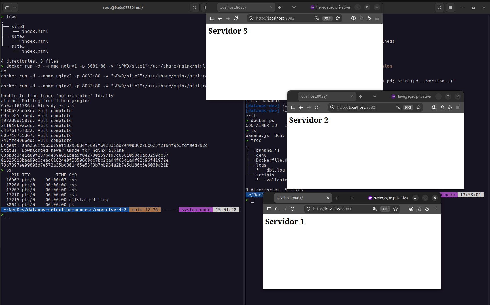

#### Explicação:
    Foram executados três containers Nginx distintos, cada um com seu próprio conteúdo HTML e sua própria porta exposta no host. O mapeamento 8081:80, 8082:80 e 8083:80 permite acessar cada container separadamente pelo navegador, mesmo todos ouvindo internamente na porta 80.

## Nível 5: Docker Compose

### Exercício 5.1 — Compose básico

- Crie um `docker-compose.yml` com:
  - Um serviço web (Nginx) na porta 8080.
  - Um serviço de banco (PostgreSQL) com variáveis de ambiente.
- Suba com `docker compose up` e verifique ambos funcionando.


#### Códigos utilizado:
```docker
services:
  web:
    image: nginx:latest
    ports:
      - "8080:80"
    volumes:
      - ./web:/usr/share/nginx/html:ro

  db:
    image: postgres:16
    environment:
      POSTGRES_USER: admin
      POSTGRES_PASSWORD: senha123
      POSTGRES_DB: appdb
```

```html
  <h1>ddddocker Compose!</h1>
```

#### Comandos executados:
```sh
docker compose up -d

docker compose ps

curl http://localhost:8080

docker logs exercise-5-1-db-1
```
#### Prints:

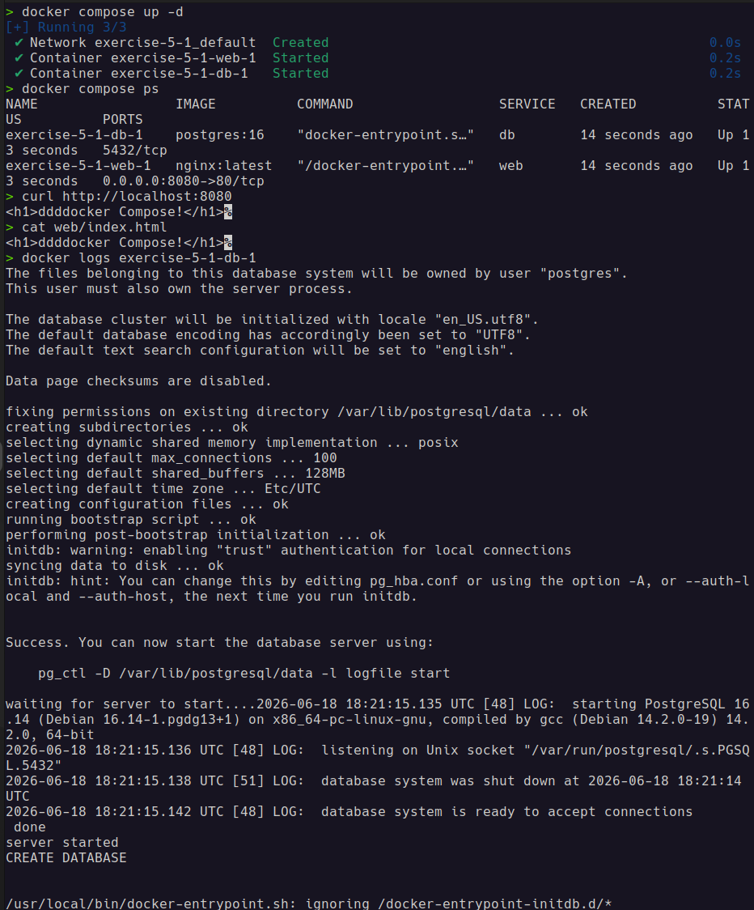

#### Explicação:

    O docker compose up -d criou dois serviços:
    
    web: Nginx escutando na porta 8080 do host.
    db: PostgreSQL iniciado com usuário, senha e banco definidos por variáveis de ambiente.
    
    O curl confirmou que o Nginx estava respondendo.
    Os logs do PostgreSQL mostraram que o banco iniciou corretamente.

### Exercício 5.2 — App completa com Compose

- Crie um compose com 3 serviços:
  - `app`: sua aplicação (com build local via Dockerfile).
  - `db`: PostgreSQL.
  - `cache`: Redis.
- Configure dependências entre os serviços.
- Use variáveis de ambiente via arquivo `.env`.

#### Prints:

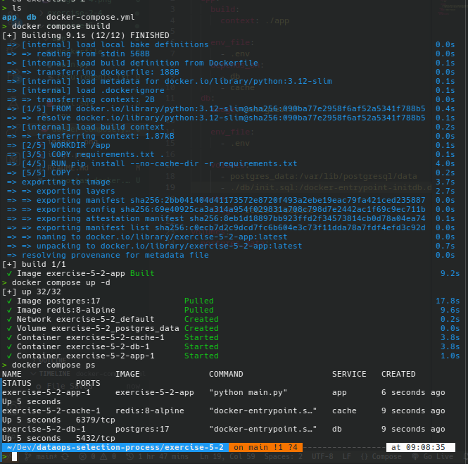

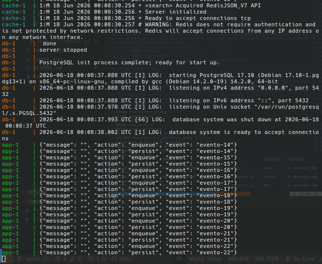

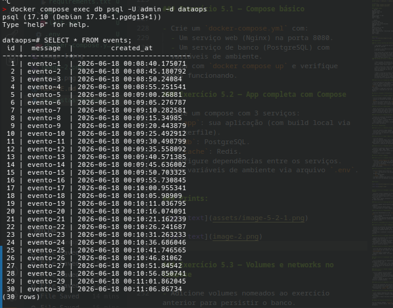

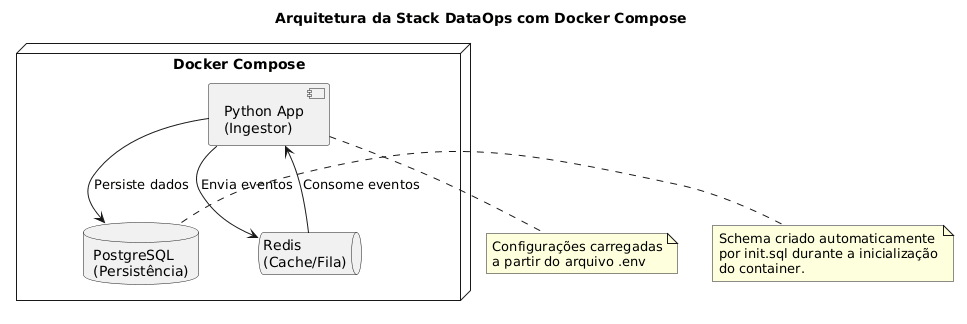
### Código utilizado:
```sh
# Estrutura de diretório
> tree -a
.
├── app
│   ├── Dockerfile
│   ├── main.py
│   └── requirements.txt
├── db
│   └── init.sql
├── docker-compose.yml
└── .env
```

```docker
# Dockerfile do app python
FROM python:3.12-slim
WORKDIR /app
COPY requirements.txt .
RUN pip install --no-cache-dir -r requirements.txt
COPY . .
CMD ["python", "main.py"]
```


```sh
# .env
POSTGRES_DB=dataops
POSTGRES_USER=admin
POSTGRES_PASSWORD=admin123

REDIS_HOST=cache
REDIS_PORT=6379

DB_HOST=db
DB_PORT=5432
```


requirements.txt do python:
```txt
psycopg2-binary
redis
python-json-logger
```

```python
import json
import logging
import os
import time

import psycopg2
import redis

from pythonjsonlogger import jsonlogger

logger = logging.getLogger()
handler = logging.StreamHandler()
handler.setFormatter(jsonlogger.JsonFormatter())
logger.addHandler(handler)
logger.setLevel(logging.INFO)

DB_HOST = os.getenv("DB_HOST")
DB_PORT = os.getenv("DB_PORT")

POSTGRES_DB = os.getenv("POSTGRES_DB")
POSTGRES_USER = os.getenv("POSTGRES_USER")
POSTGRES_PASSWORD = os.getenv("POSTGRES_PASSWORD")

REDIS_HOST = os.getenv("REDIS_HOST")
REDIS_PORT = int(os.getenv("REDIS_PORT"))

# irá enviar requisições até obter uma resposta aceitável do DB
while True:
    try:
        conn = psycopg2.connect(
            host=DB_HOST,
            port=DB_PORT,
            database=POSTGRES_DB,
            user=POSTGRES_USER,
            password=POSTGRES_PASSWORD,
        )
        break
    except Exception:
        logger.info("aguardando postgres...")
        time.sleep(3)

r = redis.Redis(host=REDIS_HOST, port=REDIS_PORT)

logger.info("Serviços conectados")

counter = 1

while True:
    event = f"evento-{counter}"

    r.lpush("events", event)
    logger.info({"action": "enqueue","event": event})
    data = r.rpop("events")

    if data:

        value = data.decode()
        with conn.cursor() as cur:
            cur.execute(
                "INSERT INTO events(message) VALUES (%s)",
                (value,)
            )
            conn.commit()

        logger.info({"action": "persist","event": value})
\
    counter += 1
    time.sleep(5)
```
O excesso de logs é justamento para ver os eventos sendo realizados, o pós e o pre evento. Especialmente em formato JSON, visando uma talvez integração com outro sistema, é sempre bom padronzar este tipo de monitoramento com formatos já estabelecidos


```docker
# docker-compose.yml
services:
  app:
    build:
      context: ./app

    env_file:
      - .env
    depends_on:
      - db
      - cache
  db:
    image: postgres:17

    env_file:
      - .env

    volumes:
      - postgres_data:/var/lib/postgresql/data
      - ./db/init.sql:/docker-entrypoint-initdb.d/init.sql
  cache:
    image: redis:8-alpine

volumes:
  postgres_data:
```
#### Comandos executados:
```sh
# build das imagens
docker compose build
# Subir as imagens e o parâmetro "-d" é apenas para que isso seja realizado em background relativo àquela instância do terminal
docker compose up -d
# mostra os containers ativos no momento
docker compose ps

# acompanha os logs do docker e seus containers
docker compose logs -f

# se aparecer que o redis realizou ações de ṕersistencia e enfileirar, significa que está sendo temporariamente armazenada no redis, e se tudo estiver certo, será persistido no BD.

#comando entre no banco de dados com o usuario e banco de dados configurados no .env
docker compose exec db psql -U admin -d dataops
```
---
```sql
-- dentro do container do banco de dados:
SELECT * FROM events;
```
---

#### Explicação:

    Foi desenvolvida uma stack utilizando Docker Compose composta por três serviços: uma aplicação Python (app), um banco de dados postgres (db) e um servidor Redis (cache). As configurações sensíveis, como credenciais do banco e endereços dos serviços, foram externalizadas para um arquivo .env. 
    
    A aplicação atua como um pequeno pipeline de DataOps, gerando eventos, armazenando-os temporariamente no Redis e posteriormente persistindo-os no PostgreSQL. O banco é inicializado automaticamente por meio de um script init.sql, responsável pela criação da estrutura necessária. 
    
    A observabilidade da solução é facilitada por logs estruturados em formato JSON, que podem ser acompanhados utilizando o comando docker compose logs -f. Dessa forma, exibe o funcionamento de um sistema distribuído


### Exercício 5.3 — Volumes e networks no Compose

- Adicione volumes nomeados ao exercício anterior para persistir o banco.
- Crie uma network explícita e atribua os serviços a ela.
- Suba, pare, remova containers e verifique que os dados persistem.

#### Códigos utilizado:
```sql
CREATE TABLE teste (id SERIAL PRIMARY KEY, nome TEXT);
INSERT INTO teste (nome) VALUES ('persistencia_ok');
SELECT * FROM teste;
```
```docker
# docker-compose.yml
services:
  web:
    image: nginx:latest
    ports:
      - "8080:80"
    volumes:
      - ./web:/usr/share/nginx/html:ro
    networks:
      - appnet

  db:
    image: postgres:16
    environment:
      POSTGRES_USER: admin
      POSTGRES_PASSWORD: senha123
      POSTGRES_DB: appdb
    volumes:
      - db_data:/var/lib/postgresql/data
    networks:
      - appnet

volumes:
  db_data:

networks:
  appnet:
    driver: bridge
```

#### Comandos executados:
```sh
docker compose up -d

docker exec -it exercise-5-3-db-1 psql -U admin -d appdb

** query sql **

docker compose stop

docker compose rm -f

docker compose up -d

docker exec -it exercise-5-3-db-1 psql -U admin -d appdb
# dentro do banco de dados
> SELECT * FROM teste;
# saindo

# lista as redes disponiveis
docker network ls
# exibe informacoes importantes sobre a rede, mais especialmente a parte de "Containers"
docker network inspect exercicio-5-3_appnet
```

#### Prints:
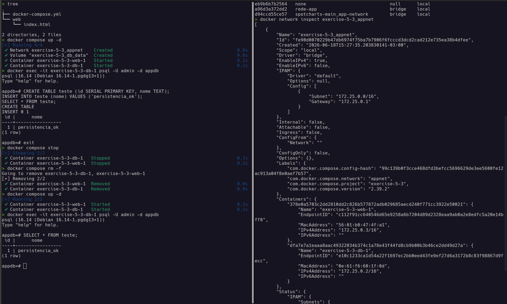

#### Explicação:

    O banco passou a usar o volume nomeado db_data, então os dados não foram perdidos mesmo após parar e remover os containers.

    A network appnet foi criada explicitamente e usada pelos dois serviços, permitindo a comunicação entre eles dentro do Compose.
    
    A tabela criada no PostgreSQL continuou existindo após recriar os containers, confirmando a persistência.
### Exercício 5.4 — Scaling de serviços

- Crie um compose com um serviço worker stateless.
- Suba 3 réplicas desse worker.
- Verifique que os 3 estão rodando.
- 
#### Códigos utilizado:
```docker
# imagem boba, apenas para demonstracao
services:
  worker:
    image: nginx:latest
```
#### Comandos executados:
```sh
docker compose up -d --scale worker=3
docker compose ps
docker ps
```
#### Prints:
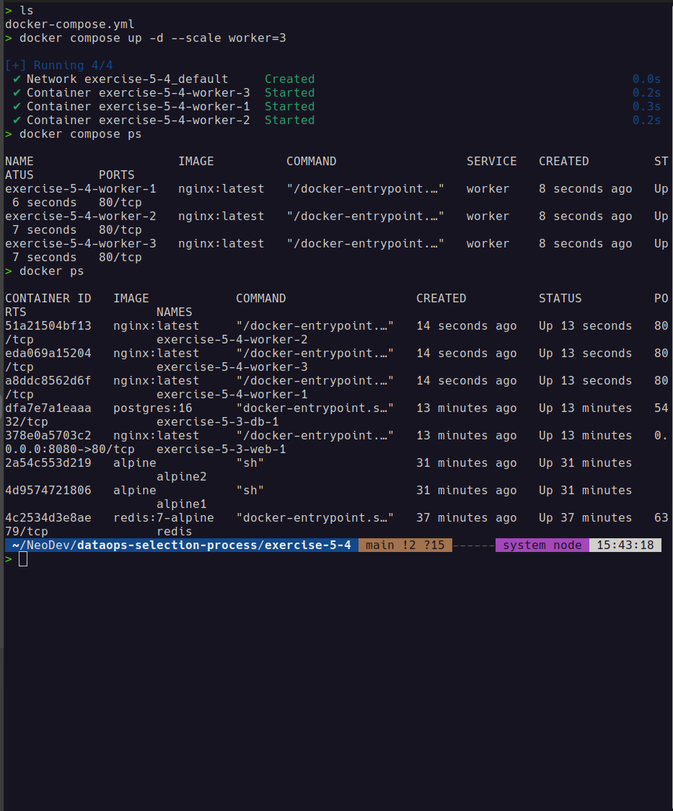

pode ter muita coisa na imagem, mas é visivel que 3 containers ngix e 3 imagens estão ativos, mudando apenas o worker

#### Explicação:
    O serviço worker foi definido como stateless, ou seja, sem volume nem banco. Isso permitiu escalar para 3 réplicas sem conflito de estado.
    
    O comando --scale worker=3 iniciou três containers do mesmo serviço.
    Com docker compose ps e docker ps, foi possível confirmar que as 3 réplicas estavam rodando.


### Exercício 5.5 — Healthcheck

- Adicione healthchecks ao seu `docker-compose.yml`:
  - Para o banco: verificação de disponibilidade.
  - Para a app: verificação de endpoint HTTP.
- Configure dependências condicionais com base no health status.

#### Códigos utilizado:
```docker
services:

  db:
    image: postgres:17
    environment:
      POSTGRES_DB: appdb
      POSTGRES_USER: appuser
      POSTGRES_PASSWORD: apppass

    healthcheck:
      test: ["CMD-SHELL", "pg_isready -U appuser -d appdb"]
      interval: 5s
      timeout: 3s
      retries: 5

  app:
    image: nginx:alpine

    depends_on:
      db:
        condition: service_healthy

    healthcheck:
      test: ["CMD-SHELL", "wget --spider -q http://localhost || exit 1"]
      interval: 10s
      timeout: 5s
      retries: 3

    ports:
      - "8080:80"
```
Exemplo de outros usos para **healthcheck**
```docker
# o healthycheck pode assumir diversas funções, como de verificar se o banco está com sua engine funcional
healthcheck:
  test:
    [
      "CMD-SHELL",
      "psql -U appuser -d appdb -c 'SELECT 1' > /dev/null 2>&1"
    ]

# Ou verificar uma tabela especifica, se uma quantidade X de usuário com tal privilégio existe no banco:
healthcheck:
  test:
    [
      "CMD-SHELL",
      "test $(psql -U appuser -d appdb -tAc \"SELECT COUNT(*) FROM usuarios WHERE privilegio='ADMIN'\") -ge 2"
    ]
# Para recursos na máquina, só séra considerado saudável se tiver pelo menos 500 mb disponivel
healthcheck:
  test:
    [
      "CMD-SHELL",
      "[ $(awk '/MemAvailable/ {print $2}' /proc/meminfo) -gt 512000 ]"
    ]

```


#### Comandos executados:
```sh
docker compose up -d

docker compose ps

docker compose logs -f

docker inspect <container_id> | grep -A 20 Health
```

#### Prints:

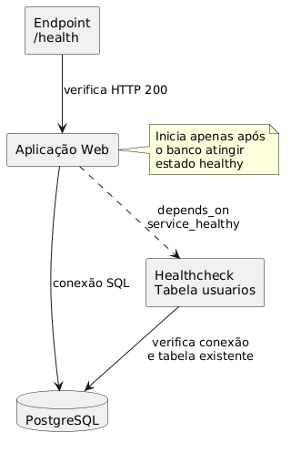

diagrama de como o fluxo de ações e eventos acontece. 


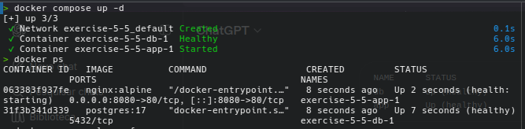

Todos os containers estão marcados com 'healthy'

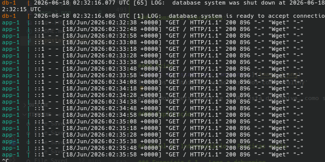

print dos wgets do app para testar se a URL está disponíve, como se fosse 'batimentos cardiacos' 

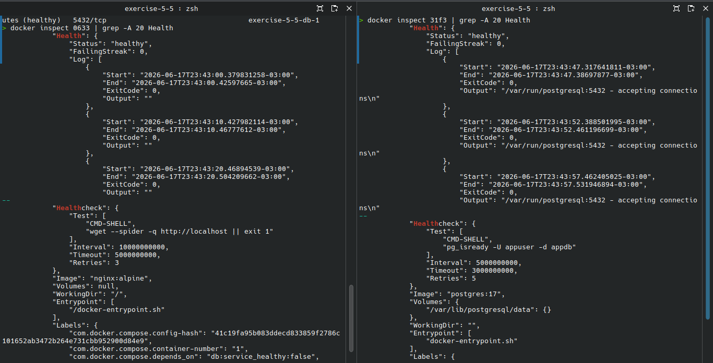

todos estão com estado de saudável

#### Explicação:

    Nesta atividade foi implementado um mecanismo de monitoramento de saúde dos serviços utilizando healthchecks no docker compose. O serviço do postgres recebeu um healthcheck personalizado que, além de verificar se o banco aceita conexões, também valida a existência de uma tabela específica da aplicação, garantindo que o banco esteja completamente preparado para uso. 
    
    A aplicação recebeu um healthcheck baseado em uma requisição HTTP para o endpoint /health, utilizando curl -f para confirmar que o serviço está respondendo corretamente. Em seguida, foi configurada uma dependência condicional com 'depends_on' e 'condition': 

    service_healthy, fazendo com que a aplicação só seja iniciada após o banco atingir o estado healthy. Durante os testes, os estados dos containers foram acompanhados através do comando docker compose ps, observando as transições entre starting, healthy e unhealthy(não aconteceu). 

    Esse mecanismo reduz problemas de sincronização (race conditions) comuns em pipelines e arquiteturas distribuídas, pois impede que serviços dependentes tentem acessar recursos ainda não disponíveis.
---

## Nível 6: Intermediário — Práticas reais

### Exercício 6.1 — Logs e debugging

- Execute um container em background.
- Visualize os logs em tempo real.
- Execute um comando dentro de um container em execução.
- Inspecione o container e encontre o IP interno.
- 
---
#### Códigos utilizado:

```docker
# Dockerfile
FROM python:3.12-slim
WORKDIR /app
ENV DB_PASSWORD=supersecret
ENV APP_ENV=production
# loop para simular processamento
CMD ["python", "-c", "import time; [print(f'Processando batch {i}') or time.sleep(2) for i in range(999)]"]
```

```sh
#debug
#!/bin/bash
set -euo pipefail

CONTAINER="${1:?Uso: ./debug.sh <container>}"
TIMESTAMP=$(date +%Y%m%d_%H%M%S)
REPORT="debug-report-${CONTAINER}-${TIMESTAMP}.txt"

echo "DEBUG REPORT: $CONTAINER" | tee "$REPORT"
echo "Gerado em: $(date)" | tee -a "$REPORT"
echo "" | tee -a "$REPORT"

echo "STATUS" | tee -a "$REPORT"
docker inspect "$CONTAINER" \
  --format '{{.Name}} | Status: {{.State.Status}} | PID: {{.State.Pid}} | OOMKilled: {{.State.OOMKilled}} | Restarts: {{.RestartCount}}' \
  | tee -a "$REPORT"

echo "" | tee -a "$REPORT"
echo "IP E REDES" | tee -a "$REPORT"
docker inspect "$CONTAINER" \
  --format '{{range $net, $cfg := .NetworkSettings.Networks}}Rede: {{$net}} | IP: {{$cfg.IPAddress}}{{"\n"}}{{end}}' \
  | tee -a "$REPORT"

echo "VARIÁVEIS DE AMBIENTE (mascaradas)" | tee -a "$REPORT"
docker inspect "$CONTAINER" \
  --format '{{range .Config.Env}}{{.}}{{"\n"}}{{end}}' \
  | sed 's/\(PASSWORD\|SECRET\|KEY\|TOKEN\)=.*/\1=***MASKED***/gi' \
  | tee -a "$REPORT"

echo "" | tee -a "$REPORT"
echo "USO DE RECURSOS (snapshot)" | tee -a "$REPORT"
docker stats "$CONTAINER" --no-stream --format \
  "CPU: {{.CPUPerc}} | Mem: {{.MemUsage}} ({{.MemPerc}}) | Net I/O: {{.NetIO}} | Block I/O: {{.BlockIO}}" \
  | tee -a "$REPORT"

echo "" | tee -a "$REPORT"
echo "ÚLTIMAS 100 LINHAS DE LOG" | tee -a "$REPORT"
docker logs --tail 100 --timestamps "$CONTAINER" 2>&1 | tee -a "$REPORT"

echo "" | tee -a "$REPORT"
echo "PROCESSOS INTERNOS" | tee -a "$REPORT"
docker exec "$CONTAINER" ps aux 2>/dev/null | tee -a "$REPORT" || echo "(ps não disponível)" | tee -a "$REPORT"

echo ""
echo "Relatório salvo em: $REPORT"
```

#### Comandos executados:
```sh
# builda a imagem do pseudo pipeline de processamento em lote
docker build -t pipeline-worker-img .

# sobe container do exemplo em background
docker run -d \
  --name pipeline-worker \
  --restart unless-stopped \
  pipeline-worker-img

# executar comandos de diagnóstico dentro do container em execução
docker exec -it pipeline-worker bash -c "ls && df -h && free -m"

# inspecionar e extrair ip interno, sendoo útil para debugging de networking entre serviços
docker inspect pipeline-worker \
  --format '{{range .NetworkSettings.Networks}}{{.IPAddress}}{{end}}'

# monitorar uso de recursos em tempo real
docker stats pipeline-worker

# executar o runbook completo de diagnóstico
chmod +x debug.sh
./debug.sh pipeline-worker

# entra no container com bash
docker exec -it pipeline-worker bash

# cria uma mensagem de log de teste
# /proc/1/fd/1 é a saida principal de logs de um container dog
echo "Uma mensagem de log de teste" > /proc/1/fd/1

# acompanhar logs em tempo real (equivalente ao tail -f de um processo de pipeline)
docker logs -f --since 30s pipeline-worker

# ver logs com timestamps (essencial para correlacionar com eventos externos)
docker logs --timestamps --tail 50 pipeline-worker
```

#### Prints:

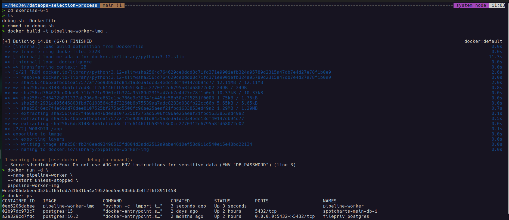

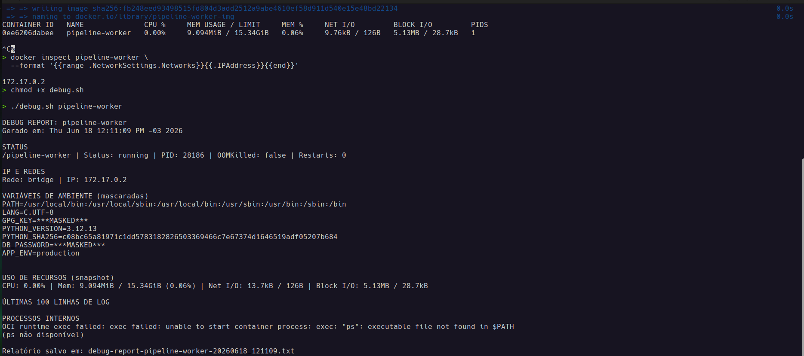

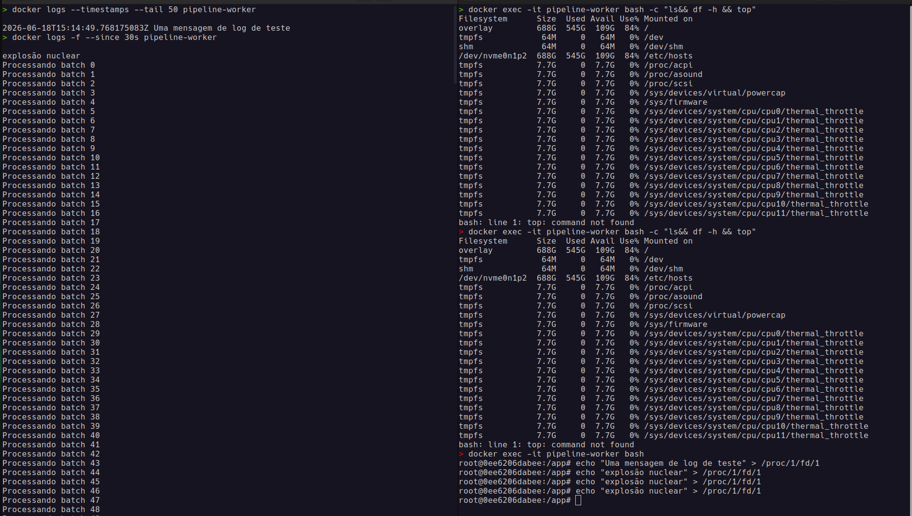

alguns problemas aconteceram porque a imagem de referencia é realmente limitada, df e free

#### Explicação:

    O arquivo debug.sh é runbook para reutilizacao e de procedimentos documentados que contém instruções passo a passo para realizar uma tarefa repetitiva, como uma "anamnese" no sistema.
    
    O container foi iniciado com política unless-stopped, workers de pipeline devem reiniciar automaticamente após falhas, mas não quando o host é desligado intencionalmente. A flag --restart always reiniciaria mesmo após docker stop, o que pode causar loops indesejados durante manutenções.
    
    O script debug.sh mascara variáveis sensíveis (senhas, tokens) antes de gravar no relatório — prática crítica quando o relatório pode ser compartilhado com outros membros da equipe ou anexado a um ticket de incidente.
    
### Exercício 6.2 — Limitar recursos

- Execute um container com limite de memória (256MB) e CPU (0.5 core).
- Instale uma ferramenta de stress e observe o comportamento ao exceder limites.
- Documente o que acontece quando o container atinge o limite de memória.

#### Comandos executados:

```sh
# build da imagem
docker build -f Dockerfile.stress -t pipeline-stress:v1 .

# Pipeline com limite seguro e que os chunks cabem na memória
docker run --rm \
  --name pipeline-safe \
  --memory="256m" \
  --memory-swap="256m" \   # desabilita swap container não escapa para disco, só tera o espaco na memória mesmo
  --cpus="0.5" \
  -e CHUNK_SIZE_MB=40 \
  -e MAX_CHUNKS=5 \
  pipeline-stress:v1

# OOMKilled (Out Of Memory Killed) é um mecanismo do kernel do Linux. Quando o sistema operacional fica sem memória RAM disponível, ele escolhe um processo (geralmente o que está consumindo mais recursos) e o "mata" para salvar o restante do sistema.
docker inspect pipeline-safe --format '{{.State.OOMKilled}}'
# irá finaliza o container apos o fim

# Pipeline que estourará o limite (400MB > 256MB)
docker run \
  --name pipeline-oom \
  --memory="256m" \
  --memory-swap="256m" \
  --cpus="0.5" \
  -e CHUNK_SIZE_MB=60 \
  -e MAX_CHUNKS=8 \
  pipeline-stress:v1

# Monitorar em tempo real (rodar em outro terminal!)
watch -n1 'docker stats pipeline-oom --no-stream'

# Verificar se o container foi morto pelo OOM killer
docker inspect pipeline-oom --format '{{.State.OOMKilled}}'
# Saída deve dar true

# Ver o evento OOM nos logs do sistema (Linux host)
dmesg | grep -i "oom\|killed" | tail -5
```

#### Prints:

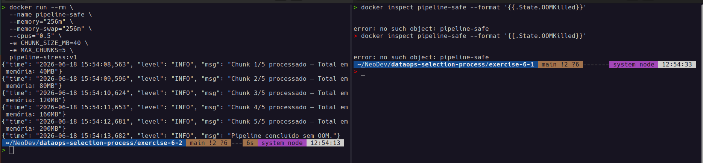

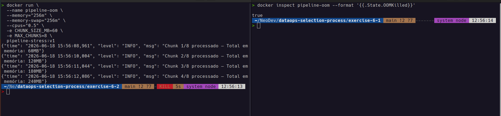

#### Explicação:

    O pipeline processou 5 chunks de 40MB (200MB total < 256MB limite). O container terminou normalmente com exit code 0.
    
    Teste 2 (OOM): Ao atingir ~256MB, o kernel Linux ativou o OOM killer e terminou o processo. docker inspect confirmou OOMKilled: true
    
    --memory-swap="256m" igual ao --memory desabilita o uso de swap — sem isso, o container poderia usar até 512MB total (256 RAM + 256 swap), mas mascarando o problema em desenvolvimento mas falhando diferente em produção.

    Pipelines Spark e pandas que leem arquivos grandes sem limites de memória são a causa mais comum de hosts de dados ficarem indisponíveis. Em um servidor com 10 containers (Airflow scheduler, workers, Redis, PostgreSQL e etc), um único pipeline sem limite pode matar todos os outros ao esgotar a RAM do host. Limites por container são a primeira linha de defesa para o abuso de recursos.

### Exercício 6.3 — Criar e publicar imagem

- Crie uma conta no Docker Hub (se não tiver).
- Faça o build de uma imagem com tag no formato `usuario/app:v1`.
- Faça push para o Docker Hub.
- Remova a imagem local, faça pull novamente e execute.

#### Códigos utilizado:
```docker
#Dockerfile
FROM python:3.12-slim

WORKDIR /app

COPY app.py .

CMD ["python", "app.py"]
```

#### Comandos executados:
```sh
docker login
docker build -t lukilme/app:v1 .
docker push lukilme/app:v1
docker rmi lukilme/app:v1
docker pull lukilme/app:v1
docker run --rm lukilme/app:v1
```

#### Prints:
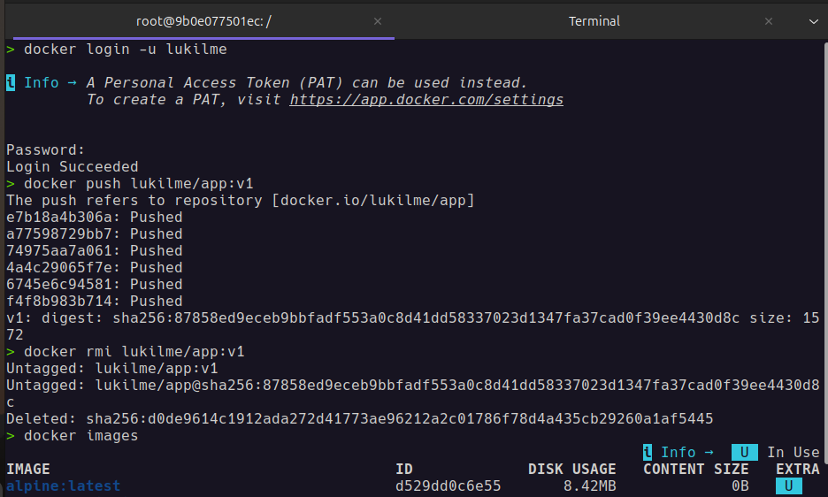

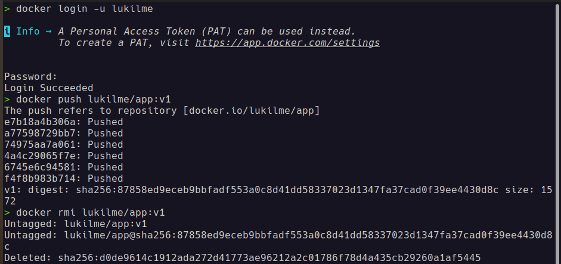

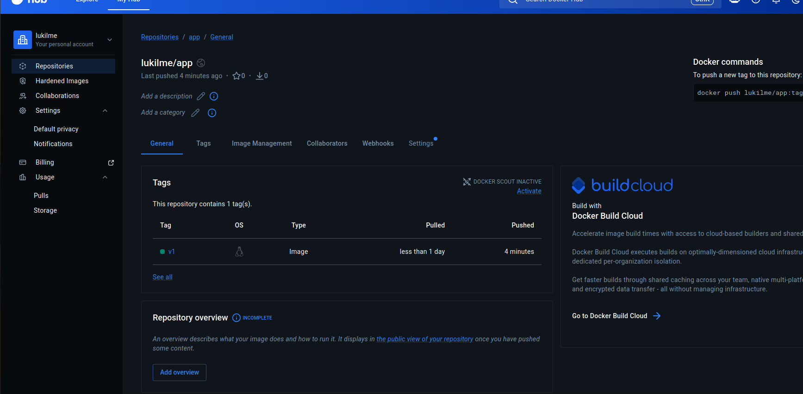
#### Explicação:

    A imagem foi criada com a tag no formato lukilme/app:v1, que é o padrão esperado para publicação no Docker Hub. Depois do build, a imagem foi enviada para o repositório remoto com docker push. Em seguida, a imagem local foi removida para simular uma nova máquina ou ambiente limpo. O docker pull baixou a imagem de volta do Docker Hub, e o docker run confirmou que ela estava funcionando corretamente.

### Exercício 6.4 — Container como ferramenta de dev

- Crie um Dockerfile de "ambiente de desenvolvimento" com:
  - Node.js, Python, Git, curl, vim.
- Execute com bind mount do seu projeto local.
- Trabalhe dentro do container sem instalar nada no host.

#### Códigos utilizado:
```sh
#!/bin/bash
IMAGE="lukilme/dataops-toolkit-dev:latest"
PROJECT_DIR="${DATAOPS_PROJECT:-$(pwd)}"

# Carrega arquivo .env se existir para evitar erro do docker
ENV_FLAG=""
if [ -f .env ]; then
    ENV_FLAG="--env-file .env"
fi

docker run --rm -it \
  --name "dataops-dev-$(basename "$PROJECT_DIR")" \
  -v "$PROJECT_DIR":/workspace \
  -v "$HOME/.dbt":/home/devops/.dbt \
  -v "$HOME/.ssh":/home/devops/.ssh:ro \
  -p 8080:8080 \
  $ENV_FLAG \
  "$IMAGE" \
  "${@:-bash}"
```

```docker
# Dockerfile.devcontainer
FROM python:3.12-slim
LABEL description="Ambiente de desenvolvimento DataOps padronizado de pipeline"

# Ferramentas de sistema essenciais + dependências de compilação (build-essential e libpq-dev) e sudo
RUN apt-get update && apt-get install -y --no-install-recommends \
    build-essential \
    libpq-dev \
    sudo \
    git \
    curl \
    vim \
    less \
    jq \
    postgresql-client \
    make \
    && rm -rf /var/lib/apt/lists/*

# Node.js para ferramentas JS
RUN curl -fsSL https://deb.nodesource.com/setup_20.x | bash - \
    && apt-get install -y nodejs \
    && rm -rf /var/lib/apt/lists/*

# Atualiza o pip e instala as ferramentas Python de DataOps
RUN pip install --no-cache-dir --upgrade pip && \
    pip install --no-cache-dir \
    dbt-core==1.8.0 \
    dbt-postgres==1.8.0 \
    pandas==2.2.0 \
    great-expectations==0.18.0 \
    sqlfluff==3.0.0 \
    pyarrow==15.0.0 \
    ipython \
    pgcli \
    httpie

# Criar usuário de desenvolvimento (mapeia para UID do host)
ARG USER_UID=1000
ARG USER_GID=1000
RUN groupadd -g $USER_GID devops \
    && useradd -u $USER_UID -g $USER_GID -m -s /bin/bash devops \
    && echo "devops ALL=(ALL) NOPASSWD:ALL" >> /etc/sudoers

# Configurações de shell úteis
RUN echo 'alias ll="ls -la"' >> /home/devops/.bashrc \
    && echo 'alias dbt-run="dbt run --select"' >> /home/devops/.bashrc \
    && echo 'export PS1="\[\033[1;34m\][dataops-dev]\[\033[0m\] \w$ "' >> /home/devops/.bashrc

USER devops
WORKDIR /workspace

CMD ["bash"]
```
#### Comandos executados:
```sh
# Build do container para desenvolvimento
docker build \
  --build-arg USER_UID=$(id -u) \
  --build-arg USER_GID=$(id -g) \
  -f Dockerfile.devcontainer \
  -t dockerhub_usuario/dataops-toolkit-dev:latest \
  .
# naturalmente será mais demorado

# "instalar" o script denv, no diretório de binários do linux, onde arquivos com permissão de execusão são naturalmente exercutado via terminal se precisar digitar o seu caminho.
chmod +x denv
sudo cp denv /usr/local/bin/denv

# 3. Entrar no ambiente de desenvolvimento
denv

# 4. Dentro do container: trabalhar sem instalar nada no host
dbt --version
vim banana.js
node banana.js 
python -c "import pandas as pd; print(pd.__version__)"
# o arquivo irá persistir mesmo após a finalizacao
mkdir scripts && cd scripts && vim validate_data.py
# para sair
exit

# 5. Rodar um comando único sem abrir shell interativo
denv dbt run --select staging
denv python scripts/validate_data.py
```
#### Prints:

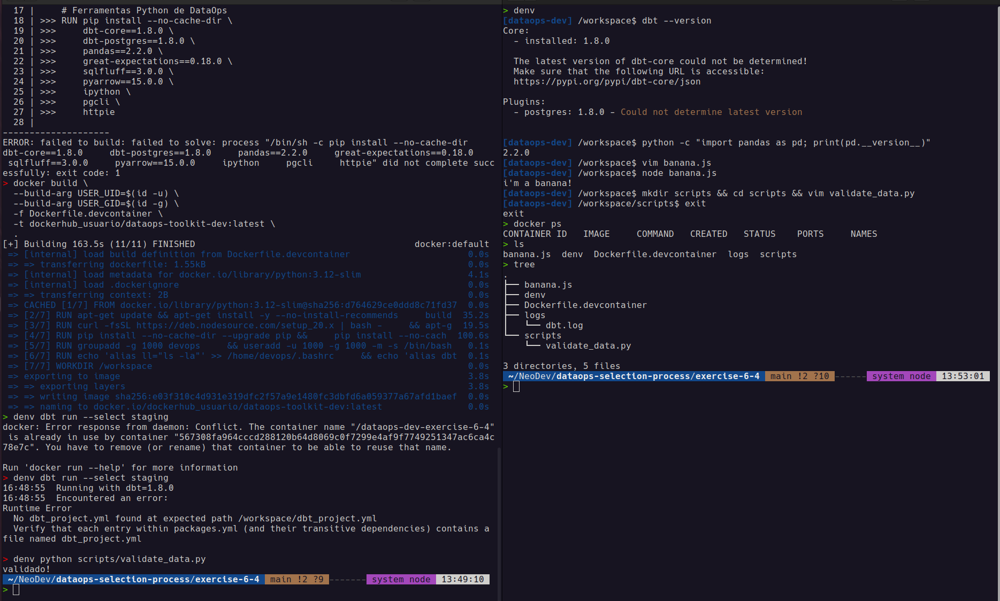
Exemplo fora e dentro do container

#### Explicação:

O devcontainer completo de DataOps que elimina o problema de "funciona na minha máquina" e serve como base para toda a equipe.

O argumento USER_UID=$(id -u) garante que arquivos criados dentro do container pertencem ao usuário do host — sem isso, arquivos gerados pelo container (como modelos dbt compilados) pertencem ao root e não podem ser editados pelo usuário do host.

Toda a equipe compartilha o mesmo ambiente: mesma versão do dbt, mesmo SQLFluff, mesmas ferramentas. "Funciona no meu container" = "funciona em produção".

### Exercício 6.5 — Docker Compose para desenvolvimento

- Crie um compose com hot-reload:
  - Bind mount do código-fonte.
  - Comando de dev com auto-reload.
  - Variáveis de ambiente para modo desenvolvimento.
- Altere o código no host e veja a aplicação atualizar automaticamente.

#### Códigos utilizado:

```python
# app/app.py
from flask import Flask

app = Flask(__name__)

@app.route("/")
def home():
    return "Aplicação em modo desenvolvimento com hot-reload!"

if __name__ == "__main__":
    app.run(host="0.0.0.0", port=5000, debug=True)
```

```docker
# Dockerfile
FROM python:3.12-slim

WORKDIR /app

COPY app/requirements.txt .
RUN pip install --no-cache-dir -r requirements.txt

COPY app/ .

CMD ["python", "app.py"]
```

```docker
# docker-compose 
services:
  web:
    build: .
    ports:
      - "5000:5000"
    volumes:
      - ./app:/app
    environment:
      - FLASK_ENV=development
      - PYTHONUNBUFFERED=1
    command: python app.py
```


#### Comandos executados:

```sh
docker compose up --build

docker compose up

docker compose logs -f
```

#### Prints:

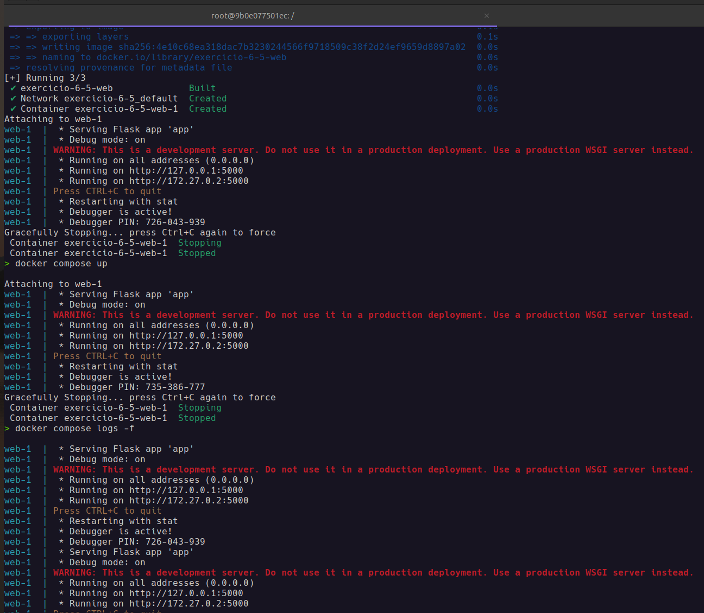

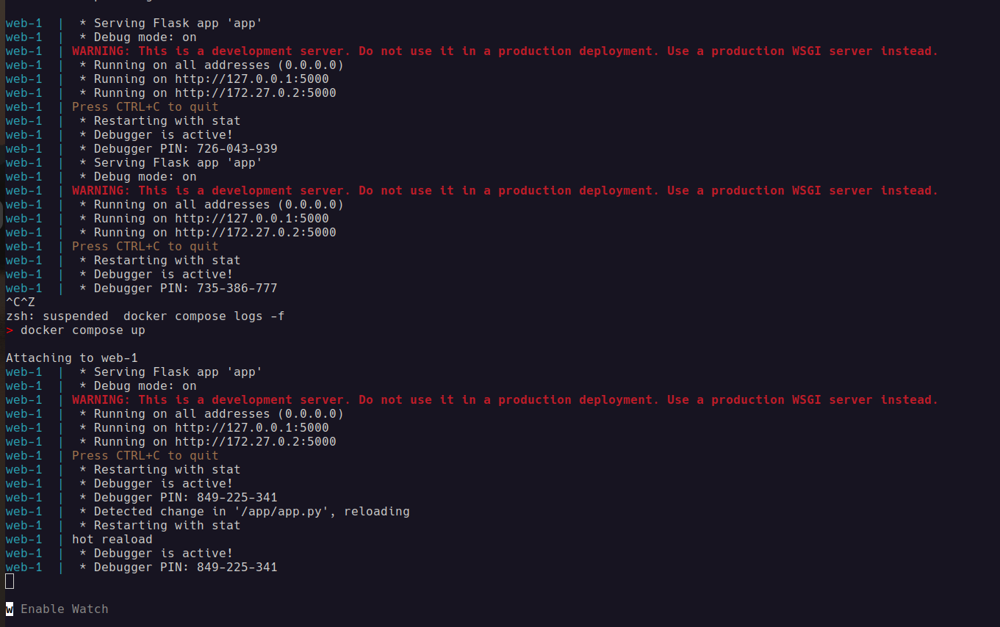

#### Explicação:

    O Compose foi configurado para desenvolvimento com bind mount, então o código da pasta app do host foi montado dentro do container. Com isso, qualquer alteração no arquivo app.py foi refletida imediatamente no container. O modo debug=True ativou o auto-reload da aplicação, permitindo que ela reiniciasse sozinha ao detectar mudanças no código.

### Exercício 6.6 — Segurança básica

- Execute um container com usuário não-root.
- Crie um Dockerfile que adicione um usuário sem privilégios e use `USER` para trocar.
- Verifique com `whoami` dentro do container.

#### Códigos utilizado:
```docker
# Dockerfile
FROM python:3.11-slim

RUN useradd -m -s /bin/bash appuser

WORKDIR /app

COPY app.py .

USER appuser

CMD ["python", "app.py"]
```

```python
# app.py
print("Aplicação executando com usuário não-root")
```

#### Comandos executados:

```sh
docker build -t app-segura:1.0 .

docker run --rm app-segura:1.0 whoami
```

#### Prints:
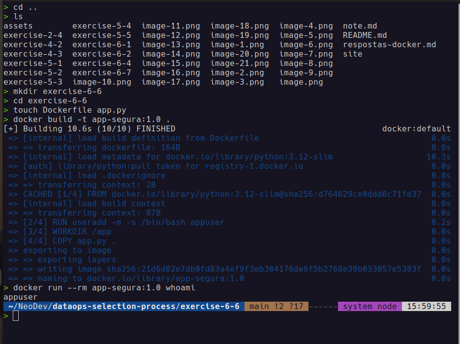

#### Explicação:
    Foi criado um usuário sem privilégios chamado appuser dentro da imagem. Em seguida, a instrução USER appuser fez com que o container passasse a executar os comandos como esse usuário, em vez de root. Ao rodar whoami dentro do container, o retorno esperado foi appuser, confirmando que a aplicação não está sendo executada com privilégios de administrador.

### Exercício 6.7 — Cleanup completo

- Liste imagens dangling (sem tag).
- Remova containers, volumes e networks não utilizados.
- Verifique o espaço em disco antes e depois da limpeza.

#### Códigos utilizado:
```sh
#!/bin/bash
# #maintenance.sh
# Configurações estritas de segurança:
# -e: Para imediatamente se um comando falhar!
# -u: Trata variáveis não declaradas como erro!
# -o pipefail: Garante que erros em pipelines (ex: cmd1 | cmd2) não sejam mascarados!
set -euo pipefail

# Configurações padrão
DRY_RUN=false
KEEP_IMAGES=5
LOG_FILE="docker-maintenance-$(date +%Y%m%d_%H%M%S).log"

# Parse de argumentos (captura flags passadas na execução do script)
for arg in "$@"; do
  case $arg in
    --dry-run) DRY_RUN=true ;;
    --keep-images=*) KEEP_IMAGES="${arg#*=}" ;; # Extrai o valor após o '='
  esac
done

# Função auxiliar para centralizar a formatação dos logs
log() { echo "[$(date '+%H:%M:%S')] $*" | tee -a "$LOG_FILE"; }

# Função que gerencia a execução real ou simulação (Dry-Run)
run() {
  if $DRY_RUN; then
    log "[DRY-RUN] $*"
  else
    log "EXECUTANDO: $*"
    # eval executa a string como comando Bash; redireciona erros (2>&1) para o log
    eval "$@" 2>&1 | tee -a "$LOG_FILE"
  fi
}

log "MANUTENÇÃO DOCKER"
log "Modo: $( $DRY_RUN && echo 'DRY-RUN (nada será removido)' || echo 'REAL' )"
log ""

# Captura e exibe o estado do disco antes da limpeza
BEFORE=$(docker system df --format '{{.TotalSpace}}' 2>/dev/null || echo "N/A")
log "Espaço em uso (antes): $BEFORE"
docker system df | tee -a "$LOG_FILE"
log ""

# Containers parados ou criados mas nunca iniciados
STOPPED=$(docker ps -aq --filter status=exited --filter status=created | wc -l)
log "Containers parados encontrados: $STOPPED"
if [ "$STOPPED" -gt 0 ]; then
  run "docker container prune -f"
fi

# Imagens dangling (camadas órfãs sem tag e sem associação a nenhum container)
DANGLING=$(docker images -qf dangling=true | wc -l)
log "Imagens dangling encontradas: $DANGLING"
if [ "$DANGLING" -gt 0 ]; then
  run "docker image prune -f"
fi

# Redes não utilizadas por nenhum container
log "Removendo redes não utilizadas..."
run "docker network prune -f"

# Volumes órfãos (Ação manual preventiva para evitar perda de dados persistentes)
UNUSED_VOLS=$(docker volume ls -qf dangling=true | wc -l)
log "Volumes não utilizados: $UNUSED_VOLS"
if [ "$UNUSED_VOLS" -gt 0 ]; then
  log "Volumes não utilizados detectados. Listando (NÃO removendo automaticamente):"
  docker volume ls -f dangling=true | tee -a "$LOG_FILE"
  log "Para remover manualmente: docker volume prune"
  log "(Volumes não são removidos automaticamente para evitar perda de dados)"
fi

# Cache de build (Libera espaço de builds antigas do BuildKit)
log "Removendo cache de build com mais de 24h..."
run "docker buildx prune --filter until=24h -f"

# Relatório final e comparação de espaço liberado
log ""
log "RESULTADO"
AFTER=$(docker system df --format '{{.TotalSpace}}' 2>/dev/null || echo "N/A")
log "Espaço em uso (depois): $AFTER"
docker system df | tee -a "$LOG_FILE"
log ""
log "Manutenção concluída. Log salvo em: $LOG_FILE"
```
#### Comandos executados:

```sh
# Verificar espaço ANTES da limpeza
docker system df

# Listar imagens dangling (sem tag, produto de builds antigos)
docker images -f dangling=true
# Essas imagens acumulam silenciosamente e podem consumir GBs em servidores de CI

# Simulação sem remover nada (dry-run)
chmod +x maintenance.sh
./maintenance.sh --dry-run

# Limpeza real
./maintenance.sh

# Verificar espaço DEPOIS
docker system df

# Ver o log da operação
cat docker-maintenance-*.log

# Limpeza total de emergência (CUIDADO: remove tudo não utilizado)
# Usar apenas quando o disco estiver crítico e não houver containers importantes parados
# Não irei executar por acreditar que possa ter algo salvo util no meus volumes
docker system prune -a --volumes -f
```

#### Prints:

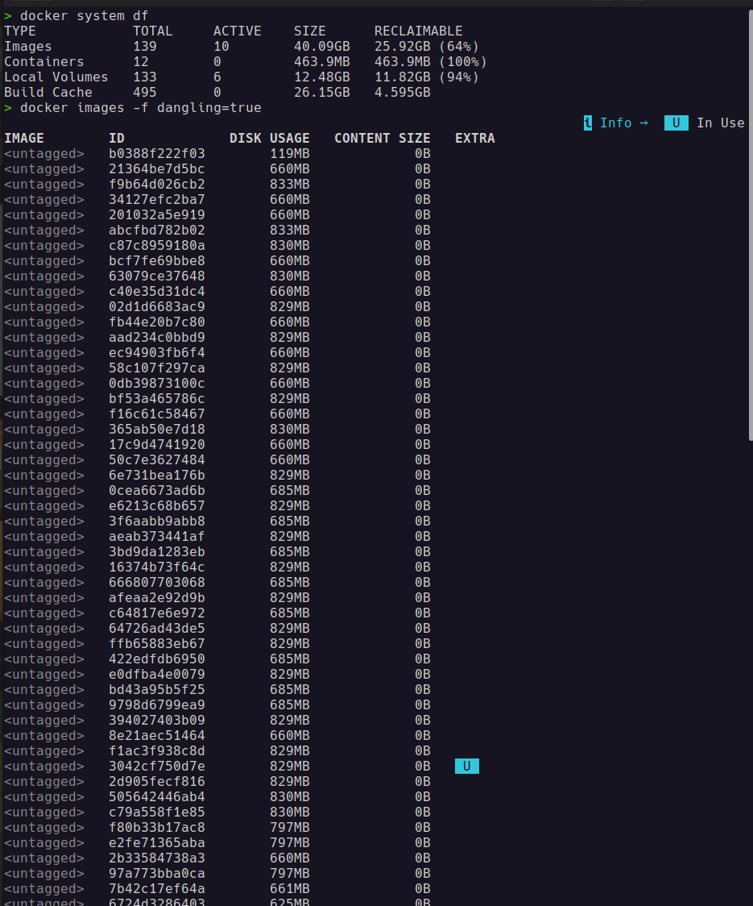

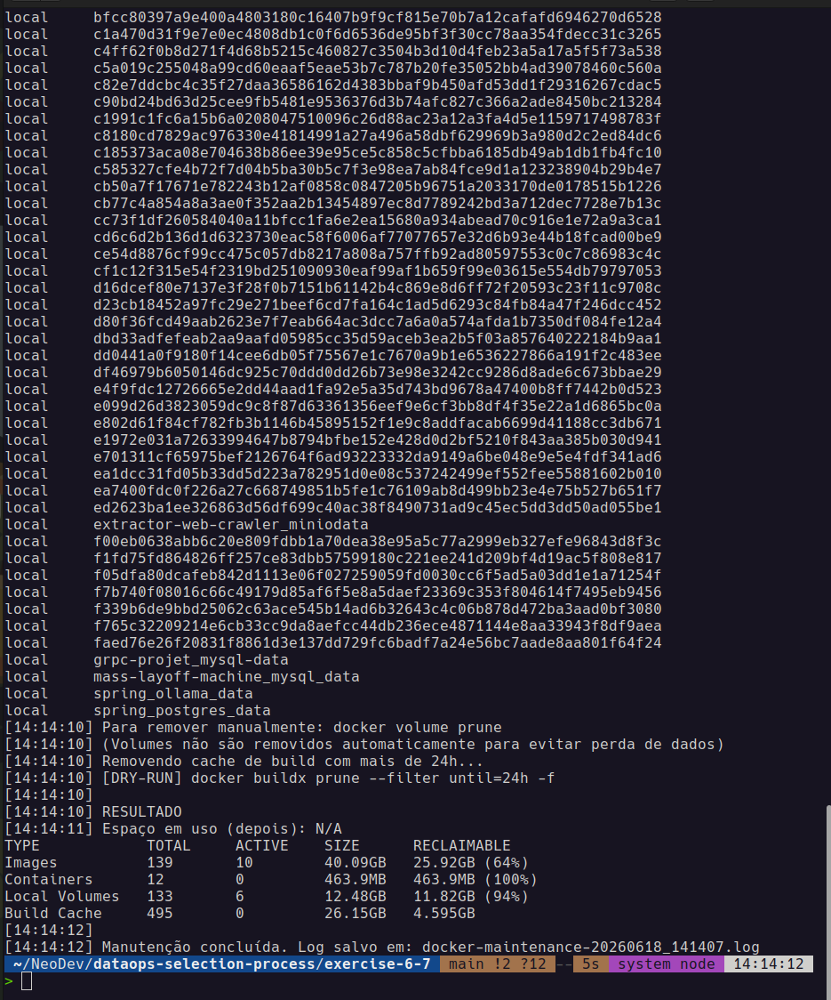

como pode ver, uso muuuuuito o docker

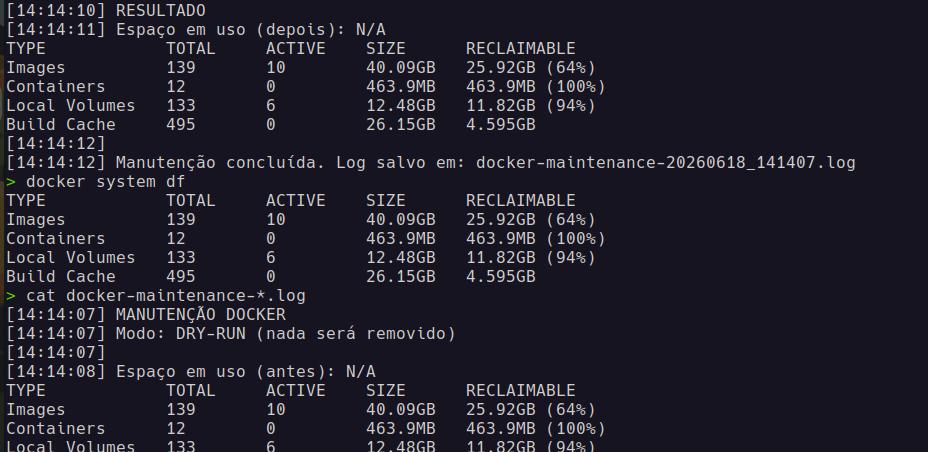

Ainda existe outro comando, mas nao usarei ele, por medo do que pode acontecer com os dados dos volumes que utilizo...
```sh
docker system prune -a --volumes -f
```

#### Explicação:

## Modelo de Arquivo de Respostas

Crie um arquivo chamado `respostas-docker.md` seguindo o formato abaixo. Para cada exercício, documente:

1. Os comandos executados (na ordem).
2. Os arquivos criados (Dockerfile, docker-compose.yml, código, etc.).
3. Uma breve explicação do que aconteceu.

#### Códigos utilizado:

#### Comandos executados:

#### Prints:

#### Explicação:

## Orientações Finais

- Mantenha o arquivo `respostas-docker.md` organizado e completo.
- Se um exercício falhar, documente o erro e como você resolveu.
- Não copie respostas prontas — o objetivo é praticar e entender.